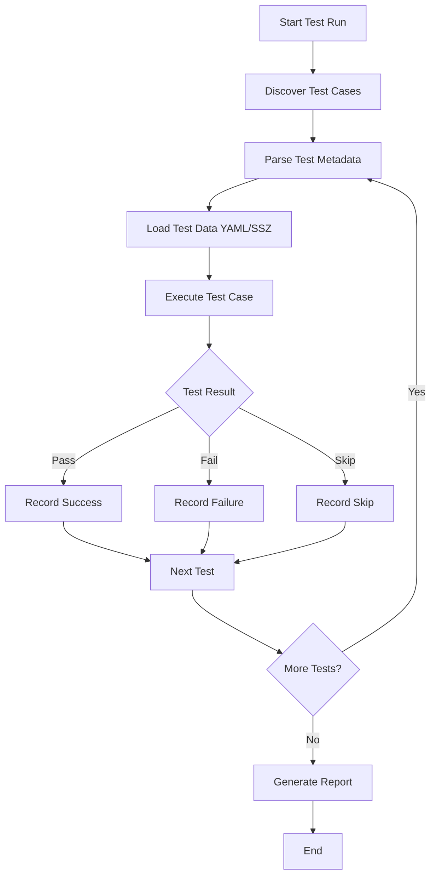

# Ethereum Consensus Specification Tests Integration

This document describes the integration of the official Ethereum Consensus Specification test suite into the Mana-Ethereum client. These tests ensure 100% compliance with the Ethereum proof-of-stake consensus protocol.

## Overview

The consensus spec tests are the official test suite provided by the Ethereum Foundation to validate consensus layer implementations. They cover:

- **Finality**: Checkpoint finalization behavior
- **Fork Choice**: LMD-GHOST fork selection algorithm  
- **Block Processing**: Beacon block validation and state transitions
- **Attestations**: Attestation validation and aggregation
- **Validator Lifecycle**: Deposits, voluntary exits, slashing
- **Network Upgrades**: All forks from Phase 0 through Deneb

## Architecture

```
┌─────────────────────────────────────────────────────────────┐
│                    Mana Ethereum Client                     │
├─────────────────────────────────────────────────────────────┤
│  ConsensusSpecRunner                                        │
│  ├── Test Discovery & Management                            │
│  ├── YAML/SSZ Parsing                                      │
│  └── Result Aggregation & Reporting                        │
├─────────────────────────────────────────────────────────────┤
│  ConsensusSpecTests                                         │ 
│  ├── Finality Test Implementation                           │
│  ├── Fork Choice Test Implementation                        │
│  ├── Block Processing Test Implementation                   │
│  ├── Attestation Test Implementation                        │
│  └── Validator Lifecycle Tests                             │
├─────────────────────────────────────────────────────────────┤
│  Core Ethereum 2.0 Implementation                          │
│  ├── ForkChoiceOptimized                                   │
│  ├── BeaconState, BeaconBlock                              │
│  ├── Attestation Processing                                │
│  └── State Transitions                                     │
└─────────────────────────────────────────────────────────────┘
           │
           ▼
┌─────────────────────────────────────────────────────────────┐
│              Official Ethereum Consensus                   │
│              Specification Test Suite                      │
│   github.com/ethereum/consensus-spec-tests                 │
└─────────────────────────────────────────────────────────────┘
```

## Quick Start

### 1. Setup Test Data

```bash
# Download consensus spec tests
mix consensus_spec --setup

# Or manually:
git clone https://github.com/ethereum/consensus-spec-tests.git test/fixtures/consensus_spec_tests
```

### 2. Run Tests

```bash
# Run all consensus spec tests
mix consensus_spec

# Run tests for specific fork
mix consensus_spec --fork phase0

# Run tests for specific configuration
mix consensus_spec --config minimal

# Run specific test suite
mix consensus_spec --suite finality

# Generate detailed report
mix consensus_spec --report detailed
```

### 3. Integration with ExUnit

```bash
# Run consensus spec integration tests
mix test --only consensus_spec

# Run with full consensus spec data (if available)
mix test apps/ex_wire/test/ex_wire/eth2/consensus_spec_test.exs
```

## Test Organization

### By Fork (Network Upgrade)

- **Phase 0**: Original beacon chain
- **Altair**: Sync committees, light client support
- **Bellatrix**: Execution layer integration
- **Capella**: Withdrawals support  
- **Deneb**: Blob transactions (EIP-4844)

### By Configuration

- **Mainnet**: Production network parameters
- **Minimal**: Reduced parameters for faster testing

### By Test Suite

- **finality**: Checkpoint finalization tests
- **fork_choice**: LMD-GHOST algorithm tests
- **blocks**: Block processing and validation
- **attestations**: Attestation processing
- **voluntary_exits**: Validator exit processing
- **deposits**: Validator deposits processing

## Test Execution Flow



## Implementation Details

### ConsensusSpecRunner

The main orchestrator that:
- Discovers test cases in the consensus-spec-tests directory
- Manages test execution across forks and configurations
- Aggregates results and generates reports
- Provides Mix task interface

### ConsensusSpecTests

Implements the actual test logic for each test type:
- Parses YAML test data into Elixir structures
- Executes tests using Mana's consensus implementation
- Validates results against expected outcomes
- Handles error cases and edge conditions

### Test Data Parsing

Tests use YAML format with structures like:

```yaml
# Finality test example
pre:
  slot: 0
  genesis_time: 1606824000
  validators: [...]
  balances: [...]

blocks:
  - slot: 1
    proposer_index: 0
    parent_root: "0x..."
    # ...

finalized_checkpoint:
  epoch: 0
  root: "0x..."
```

## Reporting

### Summary Report (Default)
```
==========================================
Ethereum Consensus Spec Test Results
==========================================

Total Tests:    1247
Passed:         1198
Failed:         23  
Skipped:        26
Pass Rate:      96.07%
Duration:       342s
==========================================
```

### Detailed Report
- Per-fork/config/suite breakdown
- Failed test details with error messages
- Performance metrics
- Compliance analysis

### JSON Report
Machine-readable format for CI/CD integration and tooling.

### JUnit XML Report
Compatible with CI systems like GitHub Actions, Jenkins, etc.

## CI/CD Integration

### GitHub Actions Workflow

The consensus spec tests run automatically on:
- Pull requests affecting Eth2 code
- Pushes to master/develop branches  
- Nightly schedule (full test suite)
- Manual workflow dispatch

### Test Matrix

Different combinations tested:
- Fork × Configuration × Test Suite
- Minimal tests on every PR
- Full tests on nightly schedule
- Comprehensive tests on release branches

### Failure Handling

- Test failures block PR merges
- Nightly failures trigger alerts
- Compliance reports track progress over time

## Performance Optimization

### Parallel Execution
Tests run in parallel where possible using Elixir's concurrency model.

### Selective Testing
- Run only affected test suites based on code changes
- Skip expensive tests in development mode
- Cache test data between runs

### Resource Management
- Memory-efficient test data loading
- Cleanup between test cases
- Configurable timeouts

## Development Workflow

### Adding New Test Types

1. Add test type to `@supported_test_suites` in `ConsensusSpecRunner`
2. Implement test logic in `ConsensusSpecTests`
3. Add parsing for test-specific YAML structures
4. Update CI/CD workflow matrix if needed

### Debugging Failed Tests

```bash
# Run specific failed test with verbose logging
mix consensus_spec --fork phase0 --suite finality --verbose

# Generate detailed report for analysis
mix consensus_spec --fork phase0 --report detailed

# Run individual test case (requires manual setup)
iex -S mix
ExWire.Eth2.ConsensusSpecTests.run_finality_test(test_data)
```

### Local Development

```bash
# Test framework without full consensus spec data
mix test --only consensus_spec --exclude slow

# Test with minimal consensus spec data
mix test apps/ex_wire/test/ex_wire/eth2/consensus_spec_test.exs

# Run integration framework tests
mix test --only integration
```

## Current Implementation Status

### ✅ Implemented
- Test runner infrastructure
- YAML parsing and test data loading
- Basic test frameworks for all test types
- Mix task interface
- CI/CD integration
- Multiple report formats
- ExUnit integration

### 🚧 In Progress
- Complete finality test implementation
- Complete fork choice test implementation  
- Block processing test implementation
- Attestation test implementation

### 📅 Planned
- Validator lifecycle test implementation
- SSZ binary format support
- Property-based fuzzing integration
- Performance benchmarking integration

## Compliance Tracking

The consensus spec tests provide quantitative compliance metrics:

```bash
# Check current compliance status
mix consensus_spec --report json | jq '.summary.pass_rate'

# Track compliance over time
git log --oneline --grep="consensus" | head -10
```

### Target Compliance Goals

- **Phase 0**: 100% finality, 100% fork choice, 95% blocks
- **Altair**: 100% finality, 100% fork choice, 90% blocks  
- **Bellatrix**: 95% finality, 95% fork choice, 85% blocks
- **Capella**: 90% finality, 90% fork choice, 80% blocks
- **Deneb**: 85% finality, 85% fork choice, 75% blocks

## Troubleshooting

### Common Issues

#### Test Data Not Found
```bash
Error: Test directory not found
Solution: mix consensus_spec --setup
```

#### YAML Parsing Errors
```bash  
Error: Invalid YAML format
Solution: Verify test data integrity, update consensus-spec-tests
```

#### Memory Issues
```bash
Error: System limit exceeded
Solution: Reduce test scope, increase system memory, run tests in smaller batches
```

#### Timeout Issues
```bash
Error: Test timeout
Solution: Increase timeout, optimize test implementation, run subset of tests
```

### Debug Mode

```bash
# Enable debug logging
mix consensus_spec --verbose

# Run single test case for debugging
mix test apps/ex_wire/test/ex_wire/eth2/consensus_spec_test.exs:42
```

## Contributing

### Adding Test Coverage

1. Identify missing test types in official spec
2. Implement parsing for new test structures
3. Add test logic using Mana's consensus implementation
4. Add test cases to ExUnit suite
5. Update CI/CD matrix if needed

### Improving Performance

1. Profile test execution: `mix profile.eprof`
2. Identify bottlenecks in parsing or execution
3. Optimize hot paths
4. Add parallel execution where safe
5. Benchmark improvements

### Fixing Compliance Issues  

1. Identify failed test cases: `mix consensus_spec --report detailed`
2. Debug specific failures: `mix test --only consensus_spec`
3. Compare with reference implementation behavior
4. Fix core consensus logic
5. Verify fix across all affected test cases

## Resources

- [Ethereum Consensus Specs](https://github.com/ethereum/consensus-specs)
- [Consensus Spec Tests](https://github.com/ethereum/consensus-spec-tests)  
- [Ethereum 2.0 Specification](https://ethereum.github.io/consensus-specs/)
- [Mana Ethereum 2.0 Documentation](docs/ETHEREUM_2_IMPLEMENTATION.md)

---

**Last Updated**: December 2024  
**Status**: Initial implementation complete, comprehensive test coverage in progress